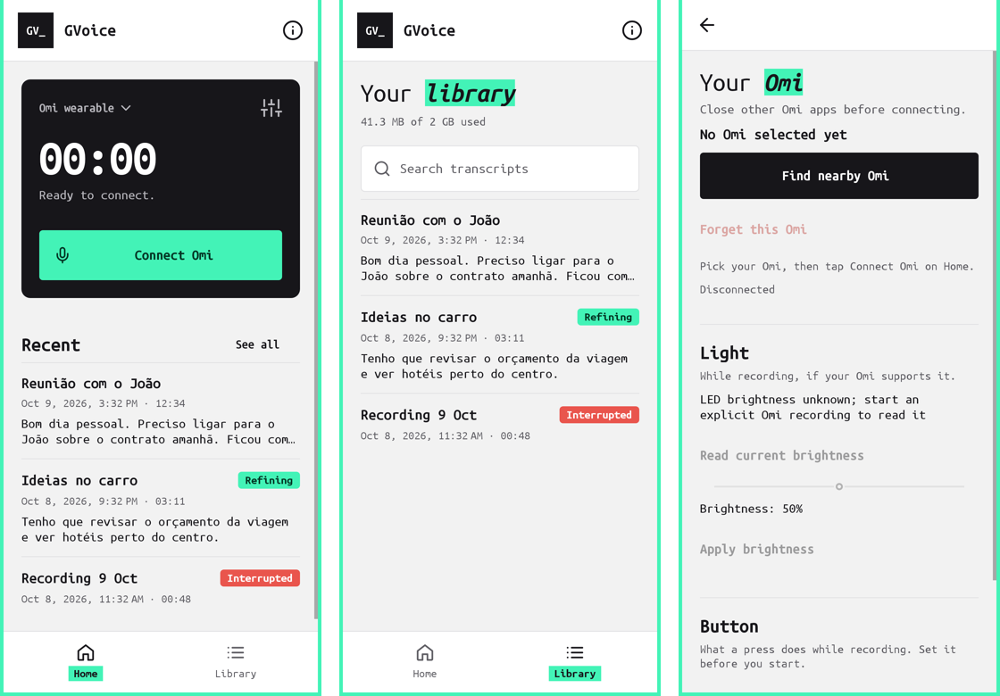

# GVoice

Offline **Omi companion for Android 8+** that transcribes Portuguese and English, and keeps everything encrypted on your phone. A fork of [NotTheOmiAIApp](https://github.com/five0nit/NotTheOmiAIApp), installed as `br.gabriel.omitarefas` so it sits beside the original. It comes with **GMind**, an optional companion app that builds a searchable personal knowledge base and is where task extraction and Todoist live.

Formerly **Omi Tarefas**. The package ID stays `br.gabriel.omitarefas`, so GVoice installs as an update over it and keeps your recordings. If you set up Obtainium with the old `^OmiTarefas-…` APK filter, change it to the one below.

Not affiliated with Omi or Based Hardware. Application license: [MIT](LICENSE); third-party components keep their [own notices](THIRD_PARTY_NOTICES.md).



## Install and update

Every merge to `main` publishes a signed release under [Releases](https://github.com/gabrielbr/NotTheOmiAIApp/releases) (`v0.5.<n>`):

| File | App |
|---|---|
| `GVoice-<version>-arm64-v8a.apk` | GVoice. Install this one. |
| `GMind-<version>.apk` | Optional GMind companion |

Both apps are signed with the same key and every release has a higher version code, so a new APK installs over the old one and keeps your data. Release details are in [RELEASING.md](RELEASING.md).

GVoice has no internet access, so it can't check for updates itself. Use [Obtainium](https://github.com/ImranR98/Obtainium) instead:

1. **GVoice:** **Add App** → `https://github.com/gabrielbr/NotTheOmiAIApp`, and set the APK filter to `^GVoice-.*-arm64-v8a\.apk$`.
2. **GMind (optional):** download `GMind-<version>.apk` from the latest release and install it by hand. Obtainium won't track a second app from the same repository.

Obtainium checks in the background, notifies you of new releases and opens Android's install prompt.

## What GVoice does

- Omi Bluetooth LE Opus audio → encrypted phone-local PCM and transcript history.
- Bundled **Vosk** (Portuguese) for streaming drafts; CPU-only multilingual **Whisper medium Q5_0** for post-save refinement, auto-detecting Portuguese or English per 30-second window.
- Playback, searchable library and explicit WAV/text export.
- No Omi account, PC relay, cloud transcription, runtime model download or `INTERNET` permission.
- Capability-gated battery, brightness and button controls. Long-press/power behavior stays firmware-owned.
- Explicit phone-microphone fallback; no automatic substitution when the wearable is absent.

## GMind companion (optional, in development)

**GMind** (package `br.gabriel.sentient`; the code still calls it Sentient) is a separate app: a personal knowledge base that collects content through plugins and stores it in an encrypted, searchable database (SQLCipher + FTS5).

- **Now:** syncs GVoice transcripts once a day (or with **Sync now**), saves WhatsApp and Signal messages from their notifications once you allow notification access, and offers full-text search with each message shown in its conversation. **Ask** answers questions about all of it, citing the messages and recordings it used: with Claude (Haiku 5.5 by default; your own API key), or privately on the phone with a downloaded model (Qwen2.5 1.5B, 1.1 GB).
- **Later phases:** task extraction to Todoist, Composio and Matrix sources, and asking questions with Claude or an on-device model. Read-only: it never acts on other services.
- **Privacy split:** GVoice stays offline. It only exposes a read-only transcript provider behind a signature permission, so only an app signed with the same key can read it. GMind is the only one of the two apps with internet access.
- Not yet tested on a phone. It uses the same design system as GVoice ([GMind audit](docs/SENTIENT-DESIGN.md)).

The full plan and status are in [PLAN-SENTIENT.md](PLAN-SENTIENT.md).

## Design system

GVoice follows the look and feel of [gabriellopes.com](https://gabriellopes.com):

- **Page:** light grey `#F2F2F2` inside a 4dp mint `#43F3B7` frame, near-black ink `#17161A`.
- **Type:** Ubuntu Mono throughout (bundled, Ubuntu Font Licence 1.0).
- **Highlighter:** one word per screen title on mint, set in bold italic.
- **Colour roles:** mint for primary actions, ink for secondary ones, coral `#E9554D` only for recording and destructive actions.
- **Shape:** 4dp buttons, 10dp panels, line icons, hairline rows instead of cards. Status chips appear only for real states such as Recording or Refining.

Tokens and components live in [`Ui.java`](app/src/main/java/app/nottheomi/ai/Ui.java). The UI audit, the token table and before/after screenshots are in [docs/DESIGN.md](docs/DESIGN.md).

## Connect and record

1. Disconnect other Omi apps, wake/charge the wearable and enable Bluetooth.
2. Tap **Connect Omi**, grant Nearby devices and notifications, then select your device. Android 8–11 also needs Location permission and system Location for BLE discovery; the app does not collect location.
3. Recording starts automatically when decoded Omi audio arrives. Preparing/Connecting is not Recording. Initial model verification/copying is local.
4. Use **Disconnect & save**, notification Stop or the configured double-press action to finish. Saved sessions remain in the library; Whisper refinement runs after capture stops.

Stop cancels retries; app launch/reboot never auto-records. Brightness zero requests minimum, not guaranteed darkness. Optional controls remain unavailable when characteristic/readback validation fails.

## Privacy and storage

AES-GCM audio/text with an Android Keystore key. Backups disabled; screen captures protected. Uninstall/data clear loses the key. User-requested exports are plaintext. Device selection and controls remain on the phone; transcript text is not placed in notifications/logs.

The **2 GiB aggregate retained PCM quota** includes existing recordings; 128 MiB free-space reserve. Portuguese live drafts; Portuguese/English saved transcripts. Recognition may be wrong. Process death may lose an uncommitted tail. Record with participants' permission.

## Build from source

Modules: `:app` (GVoice), `:sentient` (GMind) and `:plugin-api` (plain-Java plugin contracts). The Gradle command below builds both apps.

Prerequisites: Java 17, Python 3, Android SDK/platform 34, Android build-tools 34.0.0, Android NDK **27.2.12479018**, and CMake. Native build scripts target Linux/WSL. Set `ANDROID_SDK_ROOT` to your SDK location and configure `sdk.dir` in your local, untracked `local.properties` if needed.

```sh
python3 scripts/prepare_model.py
python3 scripts/build_whisper.py --ndk "$ANDROID_SDK_ROOT/ndk/27.2.12479018"
python3 scripts/prepare_llama.py
python3 scripts/build_llama.py --ndk "$ANDROID_SDK_ROOT/ndk/27.2.12479018"
./gradlew --no-daemon assembleDebug assembleRelease assembleDebugAndroidTest lintDebug --console=plain
```

The preparation script downloads and verifies pinned public models/source. Native compilation itself does not download. Build provenance is pinned in [DEPENDENCIES.json](DEPENDENCIES.json). Supported ABIs: `arm64-v8a`, `x86_64`; no 32-bit ARM. Model weights, generated native libraries, APKs, signing keys and machine configuration are excluded from Git.

Use `python3 scripts/sign_release.py --help` for signing with **your own external key directory**. Original release signing keys are not published. `tests/hybrid/verify_apk.py` checks models/native payloads, both speech engines, signature and lack of Internet permission.

## Host tests

No phone is needed for these controlled host checks. First prepare the pinned model assets and configure `sdk.dir` in `local.properties` as above: the capture installer checks use the real model files and Android SDK. The other host entrypoints use controlled doubles.

```sh
python3 tests/omi/run_ble_tests.py
python3 tests/omi-capture/run_host_checks.py
python3 tests/omi-composition/run_host_checks.py
python3 tests/capture/run_host_checks.py
python3 tests/hybrid/run_host_checks.py
python3 tests/hybrid/run_job_checks.py
python3 tests/whisper-java/run_host_checks.py
python3 tests/sentient/run_host_checks.py
python3 tests/llama-native/run_host_checks.py
```

UI screenshots (Robolectric, no device): `./gradlew testDebugUnitTest --tests '*UiScreenshotTest*'` writes PNGs of every GVoice screen to `app/build/ui-screenshots/`.

Device/instrumentation tests require their explicitly selected Android target and prepared artifacts. For the optional `tests/whisper-device/run_probe.py` helper with Windows `adb.exe`, pass `--windows-temp` with an existing Windows-accessible WSL directory; no developer-specific user path is embedded.

Public `jfk.wav` and `test.wav` are upstream test fixtures, not private recordings. The source publication contains no production-phone diagnostics, private transcripts, signing material or private Git history. Retained verification claims and freshly executed publication checks are distinguished in [verification evidence](verification/PUBLIC-SOURCE-0.4.4.md).

## Upstream

This fork is based on the NotTheOmiAIApp **0.4.4** source (versionCode 11). Upstream's [APK releases](https://github.com/five0nit/NotTheOmiAIApp/releases), the root `SHA256SUMS.txt`, `release-manifest.json` and `RELEASE-NOTES-0.3.1.md` describe upstream's older 0.3.1 binaries, not this fork. The original `app.nottheomi.ai` can only be updated with upstream's signing key; don't uninstall or clear it if you want to keep its recordings.

### 0.4.4 stability changes

- Bounded authenticated archive quota cache removes repeated whole-history scanning from the audio append hot path while preserving integrity, corruption checks and whole-request quota admission.
- Wake-lock renewal anchored to actual acquisition, including slow preparation.
- Deduplicated identical foreground notifications.
- Startup/recovery deadline regressions, archive hot-path and sustained synthetic throughput tests.

BLE gaps trigger bounded retries and separate encrypted continuation entries: playback/export do not splice audio across a known gap. Decoded PCM—not connection callbacks, battery traffic or malformed packets—proves recovery. Startup and uninterrupted no-PCM periods retain the intentional **120-second terminal policy**. Explicit Stop, storage failures and bounded-ingress safeguards remain effective.

**Physical wearable reconnection, screen-off and workday endurance are not certified.** See [public verification scope](verification/PUBLIC-SOURCE-0.4.4.md). Missing audio is not reconstructed. A permanently blocked native recognizer can delay final save/teardown.
