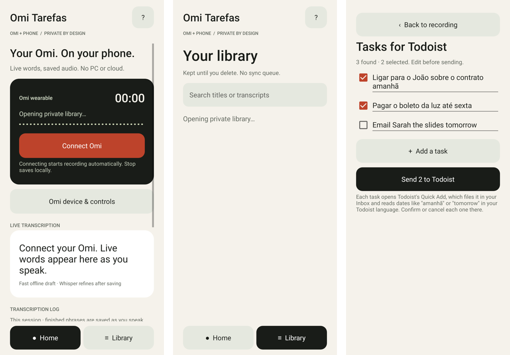
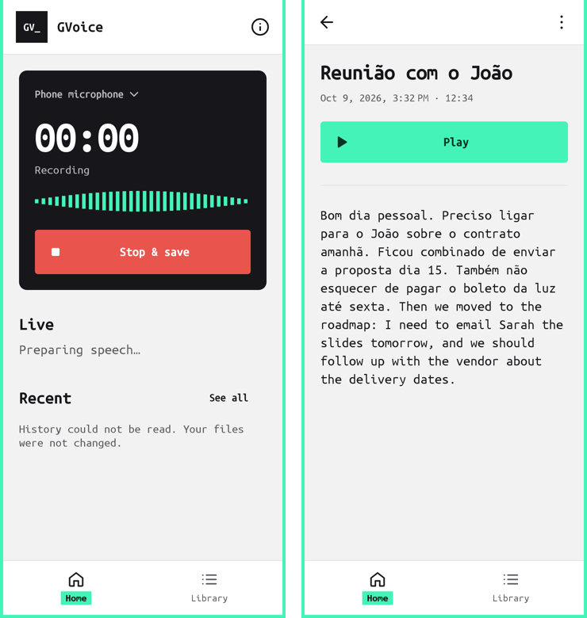

# GVoice design system and UI audit

The look and feel follows [gabriellopes.com](https://gabriellopes.com): a light grey page inside a mint frame, near-black ink, Ubuntu Mono throughout, and a mint "highlighter" behind one key word.


*Before: Home, Library, Tasks.*


*After: Home, Library, Omi device.*


*After: recording and recording detail. These are rendered on the JVM, so the timer reads 00:00 and the history can't load without the Android Keystore.*

## Audit of 0.5.3

| # | Finding | Fix |
|---|---|---|
| 1 | Home was a long scroll, with about 12 helper lines on one screen: a kicker, headline, subtitle, a hint under every block and a footer disclaimer. | Each block keeps one title and only the text that changes. The privacy and how-it-works notes moved to About (the **i** icon). |
| 2 | All-caps micro-labels (`OMI + PHONE / PRIVATE BY DESIGN`, `LIVE TRANSCRIPTION`, `TRANSCRIPTION LOG`, `SAVED ON THIS PHONE`, `TRANSCRIPT`) were decoration, not information. | Removed. Plain section titles: **Live**, **Recent**. |
| 3 | The live preview, the transcription log and the history all showed transcript text, even when idle. | One **Live** block that appears only while recording or right after it. Finished phrases are in ink, the in-progress phrase is muted. |
| 4 | Engine names were exposed to the user ("Vosk", "Whisper", "LIVE DRAFT · Whisper queued / refining"). | Plain words: *Refining*, *Live draft. Not refined yet.* |
| 5 | The recording page stacked 8 full-width buttons above the transcript, and Delete was as prominent as Play. | **Play** up front (Find tasks moved to Sentient later). Export, live draft, Rename and Delete moved to the ⋮ menu. The transcript sits right below the actions. |
| 6 | The source picker and the Omi settings were separate full-width buttons below the recorder. | Both live in the recorder panel: the source name with ▾, and a settings icon. |
| 7 | Every recording was a rounded card with a 3-part meta line and a raw status in capitals. | Rows with hairline dividers: a title, one meta line and a 2-line excerpt. A status chip appears only for real states: Recording, Refining, Interrupted, Error, Audio only, Cancelled. |
| 8 | Unicode glyphs stood in for icons (● ≡ ▶ ■ ‹ ▾ ?). | A small set of consistent line icons in `res/drawable/ic_*.xml`. |
| 9 | Tasks: the Send button scrolled away, and a 3-line explanation sat under it. | Send pinned at the bottom, one-line note. (Later removed from GVoice; tasks and Todoist now live in Sentient.) |
| 10 | Omi device: five paragraphs (compatibility, firmware, readback). | One line per section: **Light**, **Button**. Forget is shown as a destructive text action. |
| 11 | Beige/olive palette and default sans fonts, unrelated to the brand. | The design system below. |

## Tokens (`Ui.java`)

| Token | Value | Use |
|---|---|---|
| `BG` | `#F2F2F2` | Page |
| `SURFACE` | `#FFFFFF` | Header, tab bar, inputs |
| `INK` | `#17161A` | Text, dark buttons, recorder panel |
| `MUTED` | `#5E5D63` | Secondary text (contrast about 6:1 on `BG`) |
| `LINE` | `#E2E2E4` | Hairlines |
| `MINT` | `#43F3B7` | Frame, primary buttons, highlighter, active tab, meter |
| `MINT_INK` | `#033423` | Text on mint |
| `CORAL` | `#E9554D` | Recording / Stop, alert chips |
| `CORAL_TEXT` | `#B8322A` | Destructive text on light backgrounds |

- **Type:** Ubuntu Mono (regular, bold, bold italic), bundled under `res/font` (Ubuntu Font Licence 1.0).
- **Shape:** buttons and chips use 4dp corners, the recorder panel 10dp. No drop shadows.
- **Signature elements:** a 4dp mint frame around every screen, a black `OT_` monogram block in the header, and screen titles with one word on the mint highlighter.
- **Buttons** (`Ui.Style`):
  - `PRIMARY`: mint, for the main action (Connect, Play, Send).
  - `DARK`: ink, for secondary actions with weight.
  - `RECORDING`: coral, for Stop & save.
  - `QUIET`: text only.
  - `DANGER`: coral text.

## Screenshots

`app/src/test/java/app/nottheomi/ai/UiScreenshotTest.java` renders the real screens with Robolectric native graphics and sample recordings:

```sh
./gradlew testDebugUnitTest --tests '*UiScreenshotTest*'
# PNGs in app/build/ui-screenshots/
```
