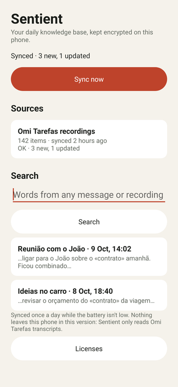
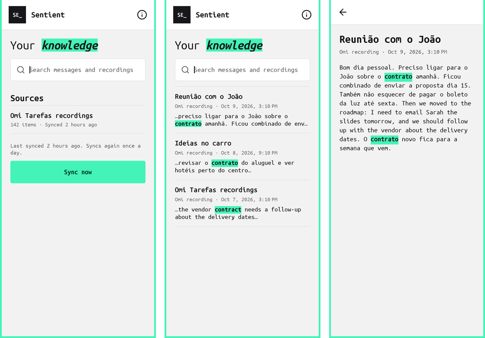
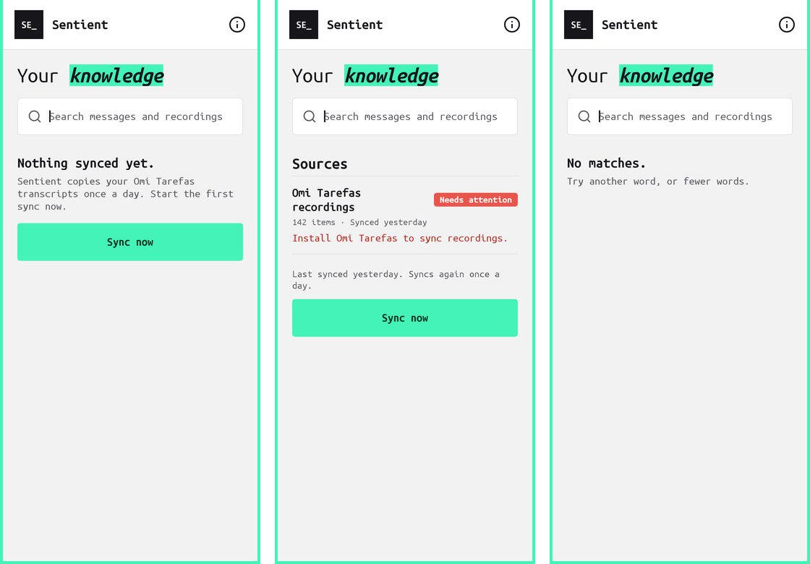

# Sentient UI audit and design system

Sentient uses the same design system as Omi Tarefas ([docs/DESIGN.md](DESIGN.md)): a mint frame, Ubuntu Mono, near-black ink, a mint highlighter on one key word, hairline rows and 4dp corners. The tokens and components are a copy of Omi Tarefas' `Ui.java` in `sentient/src/main/java/br/gabriel/sentient/Ui.java`. They are copied rather than shared because Omi Tarefas is frozen, so keep the two in step by hand. The header monogram is `SE_`.


*Before (0.5.7): one long screen.*


*After: Home, Search, Item.*


*After: first launch, a source that needs attention, no matches.*

## Audit of 0.5.7

| # | Finding | Fix |
|---|---|---|
| 1 | Search, the main task once data exists, sat below the sources and needed a separate Search button. | The search field is at the top, as in Omi Tarefas' Library. Results update 250 ms after you stop typing. |
| 2 | Two statuses competed: a global line ("Synced · 3 new…") and another status inside every source card. | One sync line above **Sync now**. Each source row shows only its count and when it last synced. |
| 3 | "Sync now" stayed tappable during a sync, with no feedback beyond a text line. | It's disabled and reads *Syncing…* from the tap until the run ends. |
| 4 | Problems were grey text inside a card ("Unavailable · Install Omi Tarefas…"). | A coral **Needs attention** chip, with the reason in coral text on that source's row. |
| 5 | Search results showed raw `«»` markers and couldn't be opened. | Matches sit on the mint highlighter. Tapping a result opens the full item, with the matches highlighted. |
| 6 | First launch said "Not synced yet", "never synced" and "0 items" in three places. | One empty state: **Nothing synced yet**, one line of explanation, then **Sync now**. |
| 7 | An explainer paragraph and a Licenses button filled the bottom of the home screen. | Both moved to About, behind the **i** icon, as in Omi Tarefas. |
| 8 | A search error overwrote the sync status line. | Errors show inline under the search field. |
| 9 | Results silently stopped at 30. | "Showing the 30 best matches." |
| 10 | Old beige palette, default sans font, rounded white cards and pill buttons. | Omi Tarefas tokens, Ubuntu Mono, hairline-divided rows, `Ui.Style` buttons, line icons. |
| 11 | The launcher icon used the old palette. | Ink background, mint centre node, white nodes. |

## Screenshots

`sentient/src/test/java/br/gabriel/sentient/SentientScreenshotTest.java` renders the real screens with Robolectric native graphics and sample rows. No database or Keystore is needed:

```sh
./gradlew :sentient:testDebugUnitTest --tests '*SentientScreenshotTest*'
# PNGs in sentient/build/ui-screenshots/
```
