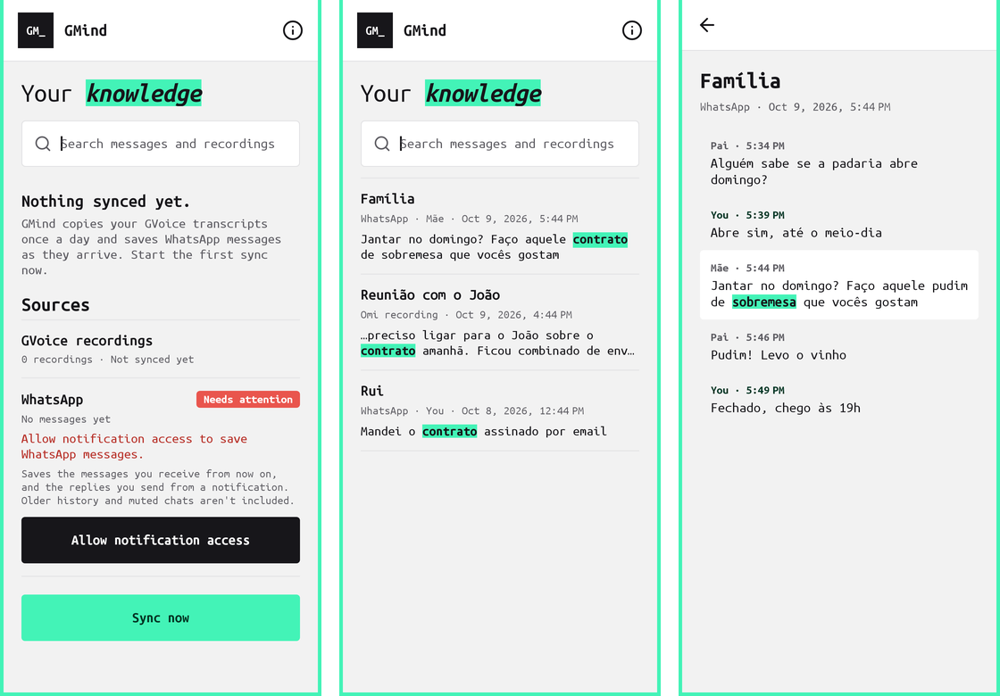
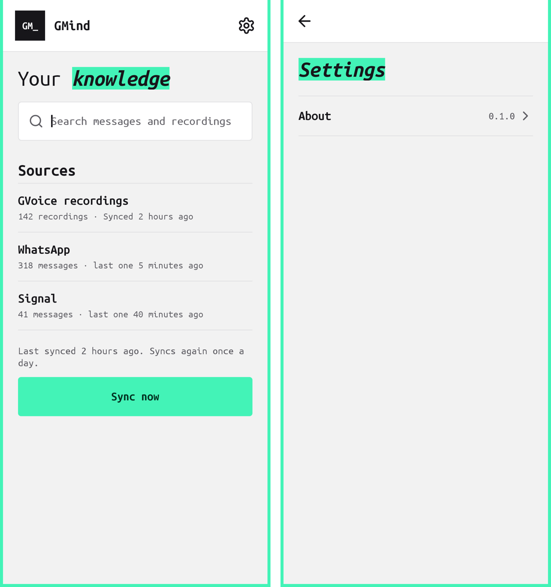
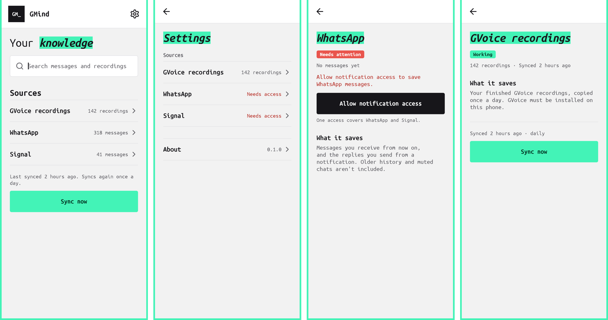

# GMind UI audit and design system

GMind (built from the `sentient` module) uses the same design system as GVoice ([docs/DESIGN.md](DESIGN.md)): a mint frame, Ubuntu Mono, near-black ink, a mint highlighter on one key word, hairline rows and 4dp corners. The tokens and components are a copy of GVoice' `Ui.java` in `sentient/src/main/java/br/gabriel/sentient/Ui.java`. They are copied rather than shared because GVoice is frozen, so keep the two in step by hand. The header monogram is `GM_`.


*Before (0.5.7): one long screen.*


*After: Home, Search, Item.*


*After: first launch, a source that needs attention, no matches.*

## Audit of 0.5.7

| # | Finding | Fix |
|---|---|---|
| 1 | Search, the main task once data exists, sat below the sources and needed a separate Search button. | The search field is at the top, as in GVoice' Library. Results update 250 ms after you stop typing. |
| 2 | Two statuses competed: a global line ("Synced · 3 new…") and another status inside every source card. | One sync line above **Sync now**. Each source row shows only its count and when it last synced. |
| 3 | "Sync now" stayed tappable during a sync, with no feedback beyond a text line. | It's disabled and reads *Syncing…* from the tap until the run ends. |
| 4 | Problems were grey text inside a card ("Unavailable · Install Omi Tarefas…"). | A coral **Needs attention** chip, with the reason in coral text on that source's row. |
| 5 | Search results showed raw `«»` markers and couldn't be opened. | Matches sit on the mint highlighter. Tapping a result opens the full item, with the matches highlighted. |
| 6 | First launch said "Not synced yet", "never synced" and "0 items" in three places. | One empty state: **Nothing synced yet**, one line of explanation, then **Sync now**. |
| 7 | An explainer paragraph and a Licenses button filled the bottom of the home screen. | Both moved to About, behind the **i** icon, as in GVoice. |
| 8 | A search error overwrote the sync status line. | Errors show inline under the search field. |
| 9 | Results silently stopped at 30. | "Showing the 30 best matches." |
| 10 | Old beige palette, default sans font, rounded white cards and pill buttons. | GVoice tokens, Ubuntu Mono, hairline-divided rows, `Ui.Style` buttons, line icons. |
| 11 | The launcher icon used the old palette. | Ink background, mint centre node, white nodes. |

## Phase 1: WhatsApp and Signal


*First launch with the WhatsApp access button, search across recordings and messages, a message in its conversation.*

- Signal works the same way, as its own source. One notification-access grant covers both apps, so the button appears once; the other row says it turns on with the same access. When Signal hides message content, its row shows a standing notice naming the Signal setting to change.
- The WhatsApp row is live: until notification access is granted it shows the coral chip, the reason and a dark **Allow notification access** button. Its limits (no older history, no muted chats) are explained only while setting up.
- Message results show who wrote them (`WhatsApp · Mãe · …`, or `You`).
- Opening a message shows the 10 messages before and after it as a chat log. The hit sits on a white panel with the search words highlighted, and your own messages are labelled *You*.

## Navigation

The UI update in [`PLAN-GMIND-UI.md`](../PLAN-GMIND-UI.md) splits the one long page into screens, step by step.


*Step 1: the gear in the header opens Settings. About moved there; more rows arrive as their features do.*

- `Ui.listRow` is the Settings row: a bold label, a short status on the right (coral when something needs attention) and a chevron.
- Settings never shows a row for a feature that doesn't work yet.


*Step 2: home and Settings list the sources as short rows; each opens its own screen.*

- A source row says a few words: *318 messages*, *Not synced yet*, or in coral *Needs access* / *Needs attention*.
- The source screen has the chip (*Working* or *Needs attention*), the counts, the problem in one coral sentence with its one fix (**Allow notification access**, **Open Signal**), **What it saves** (the limits, always shown) and, for GVoice recordings only, the sync line and **Sync now**. WhatsApp and Signal save messages as they arrive, so they have no sync button.
- The setup paragraphs and the access button are gone from the home page.

## Screenshots

`sentient/src/test/java/br/gabriel/sentient/SentientScreenshotTest.java` renders the real screens with Robolectric native graphics and sample rows. No database or Keystore is needed:

```sh
./gradlew :sentient:testDebugUnitTest --tests '*SentientScreenshotTest*'
# PNGs in sentient/build/ui-screenshots/
```
